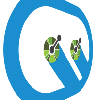

# API Framework

API Framework is a framework built on top of ASP.NET Core that aims to make building OpenAPI systems more flexible in .NET

Learn more at https://weik.io/apiframework. For documentation please visit https://docs.weik.io/apiframework/.

## Introduction 

[API Framework](https://weik.io/apiframework) aims to bring more flexibility and more options for building ASP.NET Core based OpenAPI backends. **POCOs, Nuget Packages, Roslyn scripts, Delegates**... With API Framework you have more options than just the controllers for building APIs in ASP.NET Core.

API Framework provides a flexibile platform for runtime changes. **APIs and endpoints can be added and updated when the system is running**. You can add a new plugin through Nuget and configure it to provide an OpenAPI endpoint without ever having to restart the backend.

The flexibile plugin system with a built-in support for plugins means that API Framework can be used as the secure OpenAPI gateway into other systems. **With plugins you can generate OpenAPI endpoints from databases, file systems, Azure blob storage, and more.** These endpoint provide the full OpenAPI specs, meaning if you have a table called Inventory in your database, your OpenAPI/Swagger specification will have the same Inventory available for use.

API Framework is available for .NET Core 3.1. Some parts of it are available as .NET Standard 2.0 libraries. The sweet spot for using API Framework is an ASP.NET Core 3.1 based application.

API Framework is part of the Weik.io platform. Weik.io provides open source integration, eventing and automation frameworks for .NET applications. API Framework is the "integration" part of the Weik.io platform.

## Core Features

The core features of the API Framework are:

##### Everything is an OpenAPI

The API can be anything: Database, local files. Even the web browser. APIs can be created with C#, Roslyn Scripts and using delegates.

##### Runtime Changes

APIs and endpoints can be configured runtime, when the application is running. No need to restart the system to add a new endpoint.

##### Plugin Support

API Frameworks supports plugins. Nuget.org contains multiple ready made plugins, like SQL Server and Local Files. Custom plugins can be created and shared using Nuget.

Current list of available plugins for API Framework is available from Nuget.org:

https://www.nuget.org/packages?q=Weikio.ApiFramework.Plugins

## Project Home

Please visit the project homesite at https://weik.io/apiframework for more details.

## Source code

Source code for API Framework is available from [GitHub](https://github.com/weikio/ApiFramework).

## Support & Build by

API Framework is build by [Adafy](https://adafy.com). Adafy also provides commercial support for the framework.

Adafy is a Finnish software development house, focusing on Microsoft technologies.

## License

API Framework is available as an open source, apache2-licensed project. 